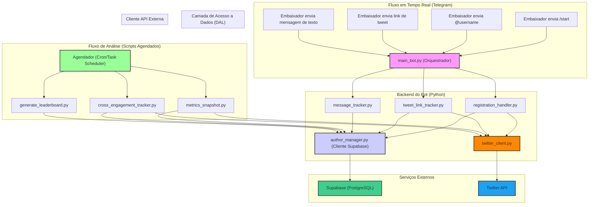

# CONTEXT.MD - Documentação Técnica Mestra do "Yellow Ambassador Engagement Tracker"

**Data da Análise:** 23 de Junho de 2025
**Analista:** Gemini Pro

## 1. Visão Geral e Arquitetura do Sistema

### 1.1. Propósito do Projeto

O "Yellow Ambassador Engagement Tracker" é um sistema automatizado para monitorar, pontuar e classificar o engajamento dos embaixadores de um programa. O sistema utiliza um bot de Telegram como interface principal para os usuários, um backend em Python para processar a lógica, uma API externa para buscar dados do Twitter e um banco de dados Supabase (PostgreSQL) para persistir todos os dados.

### 1.2. Fluxo de Dados e Arquitetura

O sistema é composto por dois fluxos principais:

1.  **Fluxo em Tempo Real (Bot do Telegram):** Interações diretas com os embaixadores.
2.  **Fluxo de Análise Assíncrona (Scripts Agendados):** Processamento de dados em segundo plano.

---

## 2. Análise Detalhada dos Módulos (`.py`)

Esta seção detalha cada arquivo de código-fonte do projeto.

---

### 2.1. `main_bot.py`

*   **Propósito:** Ponto de entrada e orquestrador principal do bot do Telegram. Inicializa a aplicação e registra todos os "handlers" (manipuladores de eventos).
*   **Imports Notáveis:**
    *   `dotenv (load_dotenv)`: Carrega as variáveis de ambiente do arquivo `.env`. É a primeira coisa a ser executada.
    *   `telegram.ext (Application, MessageHandler, etc.)`: Componentes principais da biblioteca `python-telegram-bot` para construir o bot.
    *   `registration_handler`, `tweet_link_tracker`, `message_tracker`: Importa os objetos "handler" já configurados dos outros módulos.
*   **Análise de Funções:**
    *   `main()`:
        *   **Descrição:** Função principal que configura e inicia o bot.
        *   **Lógica:**
            1.  Obtém o `TELEGRAM_BOT_TOKEN` do ambiente.
            2.  Cria o objeto `Application` (o bot em si).
            3.  Adiciona os handlers importados, definindo a ordem de execução com `group`:
                *   `group=0`: `start_handler` (registro) e `message_handler` (pontuação de atividade) têm prioridade.
                *   `group=1`: `tweet_link_handler` (rastreamento de links) roda depois.
                *   `group=99`: Um handler de "catch-all" para logar atualizações não tratadas, útil para depuração.
            4.  Chama `application.run_polling()` para iniciar o bot e começar a ouvir as atualizações do Telegram.

---

### 2.2. `author_manager.py` (Camada de Acesso a Dados - DAL)

*   **Propósito:** Módulo CRÍTICO que centraliza e gerencia **toda** a comunicação com o banco de dados Supabase. Abstrai a complexidade do cliente `supabase-py`.
*   **Imports Notáveis:**
    *   `supabase (create_client, Client)`: A biblioteca oficial para interagir com o Supabase.
    *   `asyncio`: Usado para o `_client_lock` (garantir a criação segura de uma única instância do cliente) e `asyncio.to_thread` para rodar chamadas síncronas da biblioteca de forma não-bloqueante.
*   **Variáveis Globais:**
    *   `_supabase_client: Client`: Armazena a instância única do cliente Supabase (padrão Singleton).
    *   `_client_lock: asyncio.Lock`: Previne "race conditions" durante a primeira inicialização do cliente.
*   **Análise de Funções:**
    *   `get_supabase_client()`:
        *   **Descrição:** Ponto de acesso único para o cliente Supabase. Garante que o cliente seja criado apenas uma vez.
    *   `is_author_registered(telegram_id)`:
        *   **Descrição:** Verifica se um usuário (pelo `telegram_id`) já existe na tabela `authors`.
    *   `get_author_twitter_username_from_db(telegram_id)`:
        *   **Descrição:** Busca o nome de usuário do Twitter de um embaixador já registrado.
    *   `get_twitter_id_from_telegram_id(telegram_id)`:
        *   **Descrição:** Busca o ID numérico do Twitter de um embaixador já registrado.
    *   `register_author(telegram_user, twitter_data)`:
        *   **Descrição:** Cria um novo registro na tabela `authors` com os dados combinados do Telegram e do Twitter.

---

### 2.3. `twitter_client.py`

*   **Propósito:** Centraliza a comunicação com a API externa do Twitter.
*   **Imports Notáveis:**
    *   `httpx`: Biblioteca moderna para fazer requisições HTTP assíncronas.
*   **Análise de Funções:**
    *   `get_twitter_info(username)`:
        *   **Descrição:** Busca os dados de perfil de um usuário no Twitter.
        *   **Lógica:**
            1.  Obtém a `TWITTER_API_KEY` do ambiente.
            2.  Monta a requisição para o endpoint `/twitter/user/info`.
            3.  Usa `httpx.AsyncClient` para fazer a chamada `GET`.
            4.  Valida a resposta (status 200) e extrai os dados do campo `data` no JSON de retorno.

---

### 2.4. `registration_handler.py`

*   **Propósito:** Gerencia todo o fluxo de conversação para registrar um novo embaixador.
*   **Imports Notáveis:**
    *   `telegram.ext (ConversationHandler)`: Componente chave para criar fluxos de conversa com múltiplos passos.
    *   `author_manager`, `twitter_client`: Usa os módulos centralizados para interagir com o DB e a API do Twitter.
*   **Análise de Funções:**
    *   Usa uma estrutura de `ConversationHandler` com estados (`AWAITING_USERNAME`).
    *   `start_command()`: Ponto de entrada, iniciado com `/start`. Verifica se o usuário já está registrado e, se não, pede o nome de usuário do Twitter.
    *   `handle_private_message()`: Recebe o nome de usuário, chama `twitter_client` para validar, e `author_manager` para registrar. Envia mensagens de feedback e um log detalhado para um canal específico.

---

### 2.5. `tweet_link_tracker.py`

*   **Propósito:** Processa mensagens em grupos, identifica links de tweets, valida a autoria e salva os dados do tweet no banco de dados.
*   **Imports Notáveis:**
    *   `re`: Usado para a extração de informações do link do Twitter via RegEx.
*   **Análise de Funções:**
    *   `extract_twitter_info_from_url(text)`: Usa RegEx para extrair o username e o ID do tweet de uma URL.
    *   `fetch_tweet_details(api_key, tweet_id)`: Chama o endpoint `/twitter/tweets` para obter os dados completos de um tweet.
    *   `save_full_tweet_data(tweet_data, telegram_id)`: Função complexa que salva todos os dados no Supabase:
        1.  Atualiza o perfil do autor na tabela `authors`.
        2.  Faz um `upsert` do tweet na tabela `tweets`.
        3.  Deleta as entidades antigas (`tweet_entities`) para aquele tweet e insere as novas (hashtags, menções, etc.).
    *   `process_tweet_link()`: O handler principal. Valida se a mensagem veio de um embaixador registrado, se o autor do tweet é o mesmo que enviou o link, e então orquestra a busca e o salvamento dos dados.

---

### 2.6. `message_tracker.py`

*   **Propósito:** Pontua a atividade de mensagens dos embaixadores no grupo do Telegram.
*   **Imports Notáveis:**
    *   Usa `author_manager` para verificar se o autor da mensagem é um embaixador registrado.
*   **Análise de Funções:**
    *   `get_current_session()`: Determina a "janela" de 3 horas atual para agrupar a pontuação.
    *   `update_user_activity_db()`: Atualiza a tabela `user_activity` no Supabase. Implementa uma lógica de "Read-Modify-Write" para garantir a consistência dos dados JSON.
    *   `process_group_message()`: O handler principal. Contém a lógica de pontuação, que aumenta a pontuação de forma exponencial (`bonus_multiplier`) para mensagens consecutivas dentro da mesma sessão (limitado a 10).

---

### 2.7. Scripts de Análise (Para Agendamento)

*   **`metrics_snapshot.py`**:
    *   **Propósito:** Capturar "fotos" (snapshots) das métricas de todos os tweets ao longo do tempo.
    *   **Lógica:**
        1.  Busca todos os `tweet_id` da tabela `tweets`.
        2.  Agrupa-os em lotes de 100.
        3.  Chama o endpoint `/twitter/tweets` para cada lote.
        4.  Para cada tweet retornado, insere um novo registro em `tweet_metrics_history` e faz um `upsert` na tabela `tweets` para manter os contadores principais atualizados.

*   **`cross_engagement_tracker.py`**:
    *   **Propósito:** Encontrar e pontuar interações (respostas, retweets) entre embaixadores.
    *   **Lógica:**
        1.  Busca todos os embaixadores.
        2.  Busca todos os tweets dos **últimos 3 dias** (regra de negócio implementada recentemente).
        3.  Para cada tweet, busca retweeters e respostas/quotes em paralelo.
        4.  Verifica se o autor da interação é um embaixador e não é o autor do post original.
        5.  Salva as interações válidas na tabela `ambassador_engagements`.

*   **`generate_leaderboard.py`**:
    *   **Propósito:** Orquestrar o cálculo do placar geral.
    *   **Lógica:**
        1.  Chama a função RPC `calculate_leaderboard` no Supabase, que executa toda a lógica pesada de cálculo.
        2.  Recebe os dados calculados.
        3.  Prepara e salva os registros: `upsert` na tabela `leaderboard` (placar ao vivo) e `insert` na `leaderboard_history`.
        4.  Chama outras duas funções RPC (`update_leaderboard_ranks` e `update_leaderboard_history_ranks`) para calcular o ranking final.

---

### 2.8. Módulo Legado (Pendente de Migração)

*   **`manual_contributions_manager.py`**:
    *   **Propósito:** Gerenciar a adição, edição e remoção de pontos manuais por contribuições especiais.
    *   **Estado Atual:** Este é o **único** módulo que ainda utiliza a lógica antiga, conectando-se diretamente a um arquivo de banco de dados SQLite (`engagement_database.db`) usando a biblioteca `aiosqlite`.
    *   **Ação Necessária:** Precisa ser refatorado para usar o `author_manager` e interagir com a tabela `manual_contributions` no Supabase.

---

## 3. Arquivos de Configuração

*   **`requirements.txt`**:
    *   **Propósito:** Define as dependências Python do projeto.
    *   **Conteúdo:** `python-telegram-bot`, `python-dotenv`, `httpx`, `supabase`.

---

## 4. Arquivos Legados e Para Limpeza

A análise do repositório identificou os seguintes arquivos como obsoletos, redundantes ou legados. Eles devem ser **removidos** para manter o projeto limpo.

*   `engagement_database.db`: O antigo banco de dados SQLite. **Fonte principal de confusão se mantido.**
*   `database_client.py`: Cliente de banco de dados antigo que usava `asyncpg`. Foi completamente substituído pela lógica em `author_manager.py`.
*   `inspect_schema.py`: Script de inspeção do antigo banco de dados SQLite. Obsoleto.

---

## 5. Estado Atual e Próximos Passos

### 5.1. O Que Já Funciona

1.  **Backend na Nuvem:** O sistema opera 100% sobre um banco de dados PostgreSQL no Supabase (com exceção de um módulo).
2.  **Coleta de Dados em Tempo Real:** O bot registra usuários, processa tweets e pontua mensagens de forma confiável.
3.  **Pipeline de Análise:** Os scripts de análise (`metrics_snapshot`, `cross_engagement_tracker`, `generate_leaderboard`) estão funcionais e prontos para automação.

### 5.2. O Que Falta Fazer

1.  **Limpeza do Repositório (Imediato):**
    *   Executar a exclusão dos arquivos listados na seção 4.

2.  **Automação / Cron Jobs (Imediato):**
    *   Configurar um agendador (Task Scheduler do Windows, GitHub Actions, etc.) para executar os scripts de análise com as frequências definidas:
        *   `metrics_snapshot.py`: **A cada 6 horas.**
        *   `cross_engagement_tracker.py`: **A cada 24 horas.**
        *   `generate_leaderboard.py`: **A cada 30 minutos.**

3.  **Finalizar Migração (Médio Prazo):**
    *   Refatorar `manual_contributions_manager.py` para usar o Supabase. Isso eliminará 100% da dependência do SQLite e completará a migração.
    *   Criar comandos no Telegram para que um administrador possa usar as funções deste módulo refatorado.
